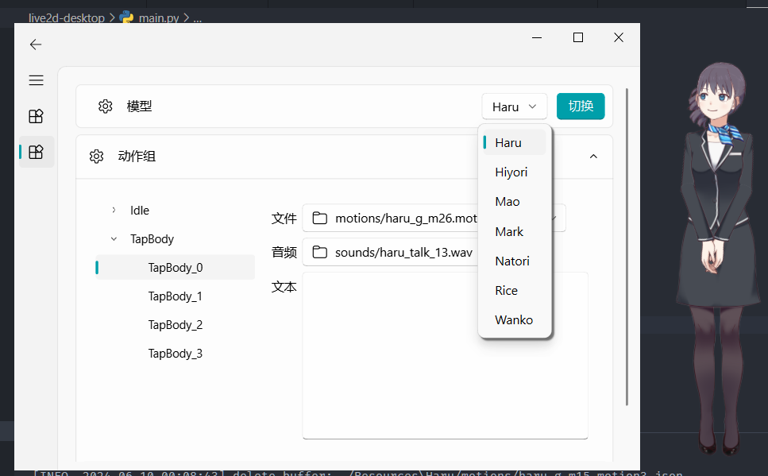

# live2d-py

Python 的 Live2D 拓展库。基于 Python C++ API 对 Live2D Native (C++) 进行了封装。理论上，只要配置好 OpenGL 上下文，可在 Python 中将 live2d 绘制在任何基于 OpenGL 的窗口。

支持：
* PyQt5
* PySide2 / PySide6
* GLFW
* FreeGlut
* ...

功能：
* 加载模型
* 鼠标点击触发动作
* 鼠标拖拽视线

## 基于 live2d-py + qfluentwidgets 实现的桌面应用

见 [live2d-desktop](./live2d-desktop/)





## 使用说明
使用接口见 [example/live2d/live2d.pyi](./example/live2d/live2d.pyi)。

详细使用示例见 [example](./example/) 文件夹。

文件：
* `live2d.so` 和 `live2d.pyd`：封装了 c++ 类的动态库，供 python 调用，在 `import live2d` 时，解释器在同文件目录下寻找 `live2d.so`/`live2d.pyd` 并载入内存。其中 .pyd 在 windows 下使用，.so 在 linux 下使用。
* `live2d.pyi`：python 接口提示文件，仅用于ide编写时的提示

### 导入库

#### 无 pip 安装

将 `example/live2d` 文件夹放置在使用者 `main.py` 同目录下，在 `main.py` 中使用 `import live2d`。 

```
example
├── live2d
│   ├── __init__.py
│   ├── live2d.pyd
│   ├── live2d.pyi
│   └── live2d.so
└── main.py
```

#### pip 安装

```
pip install live2d-py-0.1.tar.gz
```

卸载
```
pip uninstall live2d-py
```

### 绘制流程
1. 导入 live2d
```python
import live2d
```

2. 初始化 Cubism Framework
```python
live2d.InitializeCubism()
```

3. 在对应的窗口库中设置 OpenGL 上下文后，初始化 Glew 和 OpenGL 绘制选项。不同的窗口库方法不一样，以 Pygame 为例：
```python
display = (800,600)
pygame.display.set_mode(display, DOUBLEBUF|OPENGL)

live2d.InitializeGlew()
live2d.SetGLProperties()
```

4. 在上述步骤全部完成后，方可创建 `LAppModel` 并加载本地模型。路径如下：
```
Resources/Haru
├── expressions
├── Haru.2048
├── Haru.cdi3.json
├── Haru.moc3
├── Haru.model3.json
├── Haru.physics3.json
├── Haru.pose3.json
├── Haru.userdata3.json
├── motions
└── sounds
```

```python
model = live2d.LAppModel()
model.LoadAssets("./Resources/Haru/", "Haru.model3.json")
```

5. 窗口大小变化时调用 `LAppModel` 的 `Resize` 方法。**初次加载时，即使没有改变大小也应设置一次大小，否则点击位置会错位。**
```python
model.Resize(800, 600)
```

6. 鼠标点击时调用 `LAppModel` 的 `Touch` 方法。传入的参数为鼠标点击位置在窗口坐标系的坐标，即以绘图窗口左上角为原点，右和下为正方向的坐标系。
```python
x, y = pygame.mouse.get_pos()
model.Touch(x, y)
```

7. 每帧绘制图像时，先清空画布，使用 `live2d.ClearBuffer`，再调用 `LAppModel` 的 `Update` 函数。传入的两个参数为绘图窗口（画布）的长和宽。有些窗口库可能还需要刷新绘图缓冲。
```python
live2d.ClearBuffer()
model.Update(800, 600)
```

8. 结束 live2d 绘制后应调用 `live2d.ReleaseCubism` 释放内存。
```python
live2d.ReleaseCubism()
```

### PySide6 示例：

[main_pyside6.py](./example/main_pyside6.py)

```python
from PySide6.QtGui import QMouseEvent
import live2d

from PySide6.QtCore import QTimerEvent, Qt
from PySide6.QtWidgets import QApplication
from PySide6.QtOpenGLWidgets import QOpenGLWidget

def callback():
    print("motion end")


class Win(QOpenGLWidget):
    model: live2d.LAppModel

    def __init__(self) -> None:
        super().__init__()
        # self.setWindowFlags(Qt.WindowType.FramelessWindowHint | Qt.WindowType.Tool)
        self.setAttribute(Qt.WidgetAttribute.WA_TranslucentBackground, True)
        self.a = 0

    def initializeGL(self) -> None:
        # 将当前窗口作为 OpenGL 的上下文
        # 图形会被绘制到当前窗口
        self.makeCurrent()

        # 初始化Glew
        live2d.InitializeGlew()
        # 设置 OpenGL 绘图参数
        live2d.SetGLProperties()
        # 创建模型
        self.model = live2d.LAppModel()
        # 测试模型文件是否被修改过，目前来说没什么用
        print("moc consistency: ", self.model.HasMocConsistencyFromFile('./Resources/Hiyori/Hiyori.moc3'));
        # 加载模型参数
        self.model.LoadAssets("./Resources/Haru/", "Haru.model3.json")

        # 以 fps = 30 的频率进行绘图
        self.startTimer(int(1000 / 30))

    def resizeGL(self, w: int, h: int) -> None:
        # 使模型的参数按窗口大小进行更新
        self.model.Resize(w, h)
    
    def paintGL(self) -> None:
        
        live2d.ClearBuffer()

        self.model.Update(self.width(), self.height())
    
    def timerEvent(self, a0: QTimerEvent | None) -> None:
        self.update() 

        if self.a == 0: # 测试一次播放动作和回调函数
            self.model.StartMotion("TapBody", 0, live2d.MotionPriority.FORCE.value, callback)
            self.a += 1

    def mousePressEvent(self, event: QMouseEvent) -> None:
        # 传入鼠标点击位置的窗口坐标
        self.model.Touch(event.pos().x(), event.pos().y());

    def mouseMoveEvent(self, event: QMouseEvent) -> None:
        self.model.Drag(event.pos().x(), event.pos().y())


if __name__ == "__main__":
    import sys
    live2d.InitializeCubism()

    app = QApplication(sys.argv)
    win = Win()
    win.show()
    app.exec()

    live2d.ReleaseCubism()
```
