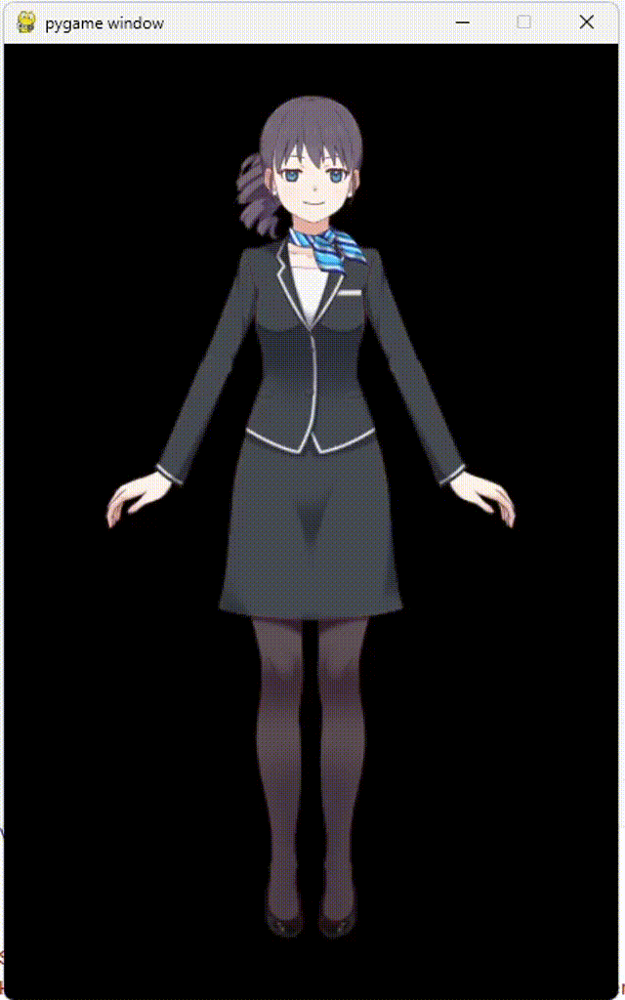

    <h1 style="text-align: center; font-family: 'Roboto', sans-serif;">live2d-py</h1>

    
    
    
    
    

---
在 Python 中直接加载和操作 Live2D 模型，不通过 Web Engine 等间接手段进行渲染，提供更高的自由度和拓展性。

Python 的 Live2D 拓展库。基于 Python C++ API 对 Live2D Native (C++) 进行了封装。理论上，只要配置好 OpenGL 上下文，可在 Python 中将 live2d 绘制在任何基于 OpenGL 的窗口。

详细使用文档：https://arkueid.github.io/live2d-py-docs/

## 支持 Live2D 模型版本
* Cubism 2.X 导出的模型：文件名格式常为 `XXX.moc`，`XXX.model.json`，`XXX.mtn`
* Cubism 3.0 及以上导出的模型：文件名格式常为 `XXX.moc3`，`XXX.model3.json`, `XXX.motion3.json` 

## 支持UI库
* PyQt5
* PySide2 / PySide6
* GLFW
* FreeGlut
* ...

## 基本操作
* 加载模型
* 鼠标拖拽视线
* 鼠标点击触发动作
* 动作播放回调函数
* 口型同步
* 模型各部分参数控制

## 平台支持

| `live2d-py` | 支持的live2d模型            | 支持的Python版本                                                    | 支持平台          |
|-------------|------------------------|----------------------------------------------------------------|---------------|
| `live2d.v2` | Cubism 2.0 及以上，不包括 3.0 | 仅 32 位，支持`Python 3.0` 及以上版本，但除 `Python 3.10.11` 外需要自行编译        | Windows       |
| `live2d.v3` | Cubism 3.0 及以上，包括 4.0  | 支持 `32` / `64` 位，支持`Python 3.0` 及以上版本，但除 `Python 3.12` 外需要自行编译 | Windows、Linux |

对于适用 Cubism 2.0 模型，目前只支持 32 位，因为当前网络上能找到的现存 live2d opengl 静态库只有 32 位。

## 安装方式
* `pip install live2d-py -v`
* [编译](#编译)
* 克隆本项目，使用`pip install . -v`安装

## 简易面部动捕示例
源码见 [main_facial_bind_mediapipe.py](./package/main_facial_bind_mediapipe.py)  

## 基于 live2d-py + qfluentwidgets 实现的桌面应用预览

见 [live2d-desktop](https://github.com/Arkueid/Live2DMascot)

